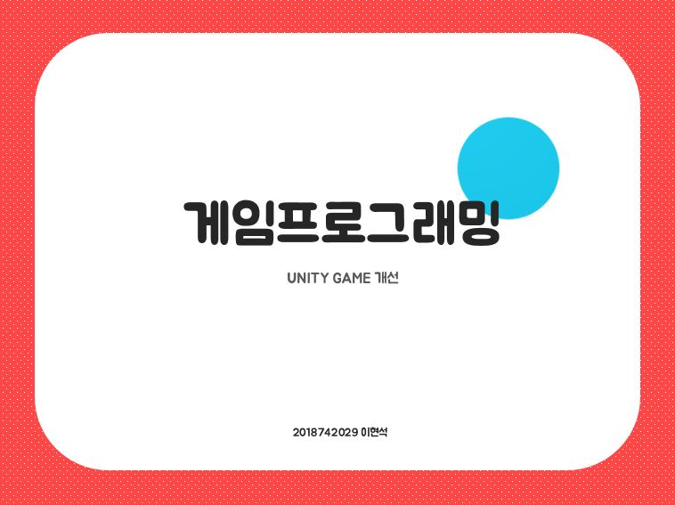

Unity 게임 개선
>기간
* 2022-11-30 ~ 2022-12-14
>보완 및 업그레이드
  * 게임 시작화면 추가
  * 화면을 3인칭 -> 1인칭으로 변경
  * 난이도 추가(방해물 생성 빈도차이)
  * 나가기 버튼 추가
  * 앞뒤 방향키 입력 무시를 위해 기존 코드 변경
  * 배경 음악추가
  * 랜덤위치 방해물 생성
  * 방해물이 Player 방향으로 오도록 설정
  * 방해물과 부딪힐 경우 게임종료
  * 방해물과 부딪힐 경우 효과음 출력
  * 스코어가 시간이 지날수록 자동으로 올라감
  * 시간이 지남에 따라 방해물 속도 증가
  * 게임이 끝났을 경우 난이도 별로 가장 높은 스코어 출력
  * 게임도중 Esc를 누르면 게임이 일시정지 됨
  * 게임도중 R키를 누르면 게임이 재시작 됨
  * 게임 종료 화면 추가
  * 땅(도로)과 방해물(차)에 에셋 추가
> 발표 자료

> 마지막 수정 날짜(2022-12-14)
